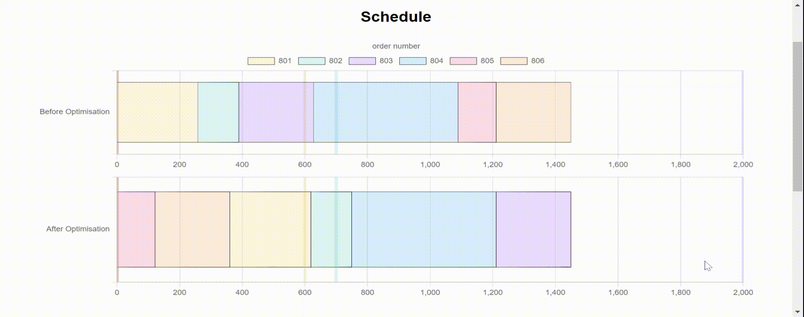
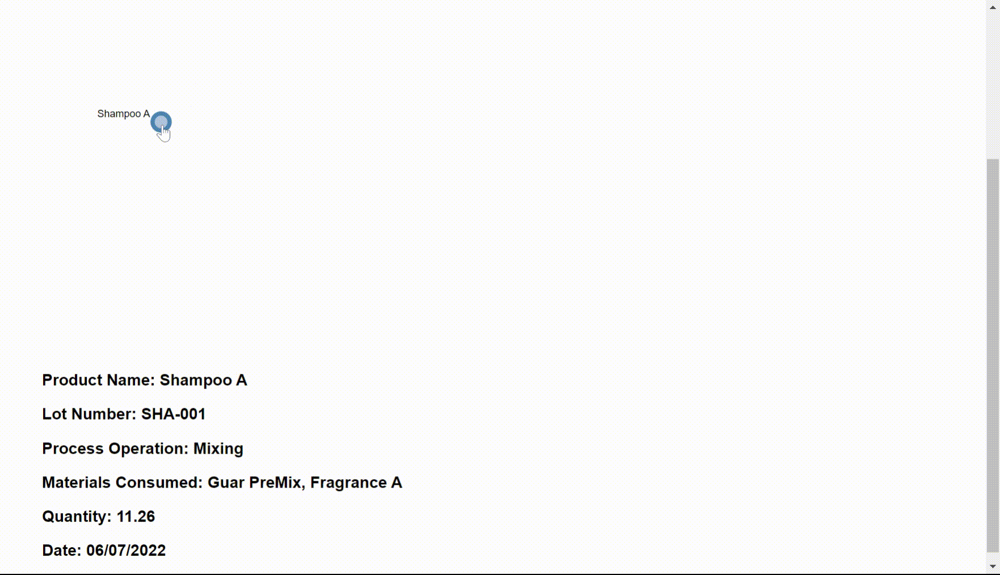
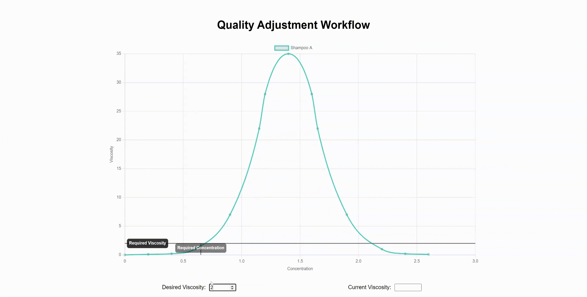

# Manufacturing Data Visualisation

This repo hosts the code for a static website to showcase visualisations built to demonstrate the capabilities of the virtual factory and the workflows integrating with the MES. These can be integrated into the MES using the Web Browser component in OMI - see instructions [here](./docs)

### 1. Schedule Optimisation

[Code & Implementation Details](./src/scheduling/)

This visualisation aims to show the differences in the optimised and unoptimised schedule for production line.

The first group of charts are interactive: clicking on the individual bars (work orders) will filter the chart and display metrics e.g. how early/late the work order is.

### 2. Traceability Tree

[Code & Implementation Details](./src/traceability/)

This visualisation aims to visualise the genealogy of products within the MES and provide an intuitive interface for process engineers to follow products through the process.

The nodes and links in the tree display contextual data when clicked on and hovered.

### 3. Salt Curve

[Code & Implementation Details](./src/traceability/)

This visualisation aims to demonstrate how the the concentration values are calculated from viscosity measurements by the virtual factory model, the real calculations will be carried out server side and accessed by the MES via an API - this is solely for visualisation purposes only.

The current and desired viscosities are added as annotations and the concentration is interpolated, the current inteprolate is simplified to be linear since this is just a visualisation, however the interpolate method can be changed in the implementation (see code and implementation links above).

---

##### feel free to contact ismailmo4@gmail.com for any support/issues.
