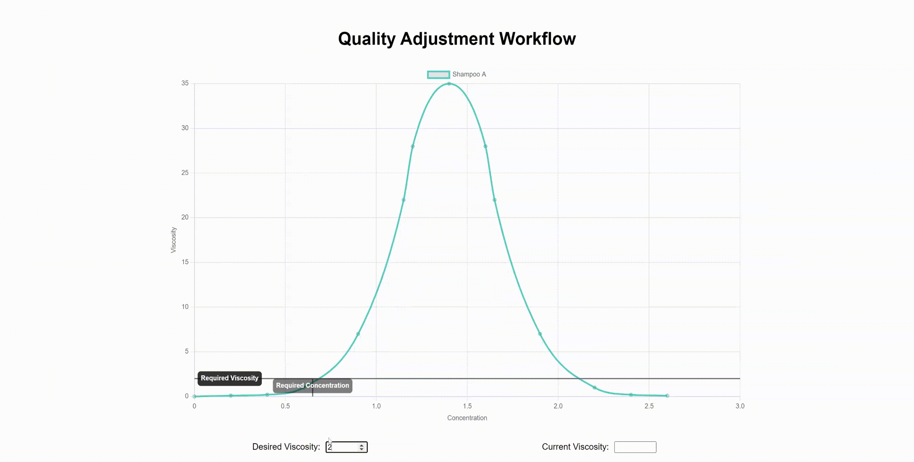

# Schedule Optimisation



The purpose of this visualisation is to demonstrate the method used in the quality correction model to derive a correction value - thus it hasnt been developed to produce accurate data.

[Chartjs](https://www.chartjs.org/) and [chartjs-plugin-annotation](https://www.chartjs.org/chartjs-plugin-annotation/latest/guide/) were used to implement this visualisation (same as the [scheduling visualisation](../scheduling/README.md)).

## Salt Curve

The salt curve chart is a simple scatter chart with a [monotone cubic interpolation line](https://www.chartjs.org/docs/latest/samples/line/interpolation.html) (it looks closest to a line of best fit).

```
// ./scripts/saltCurveChart.js

export const saltCurveChart = new Chart(saltCurveCtx, {
  type: "scatter",
  data: {
    ...
    datasets: [
      {
        ...
        cubicInterpolationMode: "monotone",
      },
    ],
  },
}

```

## Annotations

There are three line annotations added to the chart:

1. current viscosity
2. desired viscosity
3. concentration difference

Current and desired Viscosity lines are added in two parts, first the horizontal line is drawn:

```
// ./scripts/annotations.js

function addViscosityLine(viscosityValue, label, chart) {
  const annotation = {
    type: "line",
    label: { enabled: true, content: `${label} Viscosity`, position: "start" },
    xMin: 0,
    xMax: maxXAxis,
    yMin: viscosityValue,
    yMax: viscosityValue,
    backgroundColor: "rgba(255, 99, 132, 0.25)",
  };

  chart.options.plugins.annotation.annotations[`${label} Viscosity`] =
    annotation;
  chart.update();
}

```

The vertical line is then drawn:

```
// ./scripts/annotations.js

function addInterpolationLine(viscosityValue, label, chart) {
  const conc = calculateConcentration(
    viscosityValue,
    viscosityVals,
    concentrationVals
  );
  const annotation = {
    ...
    xMin: conc,
    xMax: conc,
    yMin: 0,
    yMax: viscosityValue,
  };

  chart.options.plugins.annotation.annotations[`${label} Concentration`] =
    annotation;
  chart.update();
}

```

To calculate the concentration (i.e. the point at which to draw the vertical line) we use a linear interpolation (this is where you can fix the misalignment of the vertical line with the curve - replace `linearInterpolate` with the actual function of the curve) if you want/need to:

```
export function calculateConcentration(
  viscosity,
  viscosityDataset,
  concentrationDataset
) {
  const [point2, point1] = getSurroundingPoints(
    viscosity,
    viscosityDataset,
    concentrationDataset
  );
  const xVal = linearInterpolate(viscosity, point1, point2);
  return xVal;
}

```

The concentration difference line is a horizontal line that calculates the distance between the desired and current concentrations (from the interpolations above) - thus providing a concentration amount that needs to be added to the product mix:

```

function addConcentrationDifferenceLine(chart) {
    ...
    const diffAnnotation = {
      ...
      type: "line",
      xMin: currentConc,
      xMax: requiredConc,
    };
    ...
  }
}
```

## Data

The two data sources required are: the salt curve data - to draw the chart, and the viscosity values - to draw the annotations.

The salt curve data in `./scripts/data/saltCurve.json` just contains 2 arrays, but since this is data corresponding to a specific product mix, it can be changed so there are multiple objects with the product as a key, so instead of:

```
// current data

{
    "concentration": [
        0, 0.2, 0.4, 0.6, 0.9, 1.15, 1.2, 1.4, 1.6, 1.65, 1.9, 2.2, 2.4, 2.6
    ],
    "viscosity": [
        0, 0.1, 0.2, 1.0, 7, 22, 28, 35, 28, 22, 7, 1.0, 0.2, 0.1, 0
    ]
}
```

it can be changed to:

```
// future data structure

{
    "productA":
        {
            "concentration": [
                0, 0.2, 0.4, 0.6, 0.9, 1.15, 1.2, 1.4, 1.6, 1.65, 1.9, 2.2, 2.4, 2.6
            ],
            "viscosity": [
                0, 0.1, 0.2, 1.0, 7, 22, 28, 35, 28, 22, 7, 1.0, 0.2, 0.1, 0
            ]
        },
    "productB":
    {
        "concentration": [
            0, 0.2, 0.4, 0.6, 0.9, 1.15, 1.2, 1.4, 1.6, 1.65, 1.9, 2.2, 2.4, 2.6
        ],
        "viscosity": [
            0, 0.1, 0.2, 1.0, 7, 22, 28, 35, 28, 22, 7, 1.0, 0.2, 0.1, 0
        ]
    },
    ...
}
```

For the viscosity values, the current value will need to be sourced from a live data source (e.g. the OPC server or VF API) to get the value measured from the production line. The desired viscosity value will be stored in the MES (see the quality module) so it can be retrieved from the database or preferably the web API.

To bind this data to the data, replace the event listeners below which currently use data from input:

```
// ./scripts/main.js

desiredViscosityInput.addEventListener("input", (e) => {
  const viscosity = e.target.value;
  updateAnnotations(viscosity, "Required", saltCurveChart);
});

currentViscosityInput.addEventListener("input", (e) => {
  const viscosity = e.target.value;
  updateAnnotations(viscosity, "Current", saltCurveChart);
});

```
