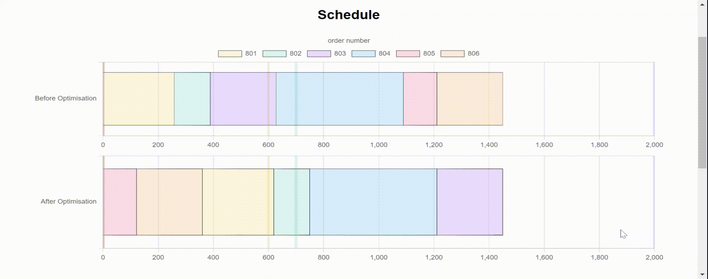
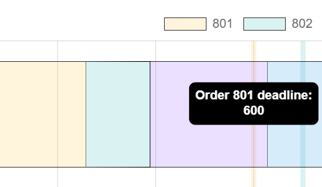
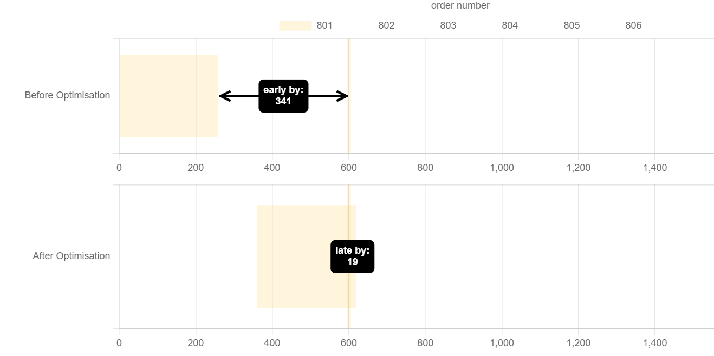
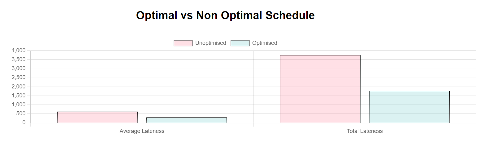

# Schedule Optimisation



The goal of this visualisation is to show the changes in schedule after optimisation by the virtual factory models and highlight the improvements it makes. In this case, the optimisation reduces the lateness of orders by shuffling around the orders, so earlier due dates are prioritised, however this optimisation can be extended in the future to optimise for other parameters, e.g. changeover time.

If you haven't used [chartjs](https://www.chartjs.org/) before, spend some time going through the [getting started](https://www.chartjs.org/docs/latest/) guide to make it easier to understand the rest of this documentation.

## Schedule view

These are just stacked bar charts, where the y axis is set as the index axis so it is horizontal, the relevant options to pass to the chart object is below:

```
//.scripts/charts/scheduleChart.js

options: {
    indexAxis: "y",
    scales: {
        x: {stacked: true},
        y: {stacked: true}
        }
    }
}
```

### Annotations

These were implemented using the [chartjs-plugin-annotation](https://www.chartjs.org/chartjs-plugin-annotation/latest/guide/) plugin. If you are going to add a new chart, make sure you register the plugin for each file you import the `Chart` object from chartjs:

```
Chart.register(annotationPlugin);
```

#### Deadline Annotations



Vertical lines were added to the chart to show the deadlines for each order by passing a function to the annotation plugin so the deadlines can be dynamically calculated from the optimised data:

```
//.scripts/charts/scheduleChart.js

 options: {
    plugins: {
        annotation: {
            drawTime: "beforeDatasetsDraw",
            annotations: () => getDeadlineAnnotations(vfData, bgColourMap),
        }
    }
}
```

`getDeadlineAnnotations` returns an object containing annotation objects (with the order number as the key) for each order in `vfData` - the optimisation results from virtual factory:

```
// ./scripts/utils/annotations.js

export function getDeadlineAnnotations(vfData, bgColourMap) {
    const deadLines = {};
    vfData.forEach((order, idx) => {
        deadLines[order["order_number"]] = {
            type: "line",
            label: {...},
            xMin: order["dead_line"],
            ...
        };
    });
  return deadLines;
}
```

#### Lateness Annotations



The lateness annotations are added via the `onClick` handler for the schedule charts.

```
// ./scripts/charts/scheduleCharts.js
export const afterChart = new Chart(afterCtx, {
    ...
    options: {
        onClick: barClickHandler,
        ...
    }
}

```

The bar click handler only shows the lateness for the clicked order for both charts (`data.label` is the order number):

```
// ./scripts/utils/eventHandlers.js

export function barClickHandler(event, elements) {
    ...
    filterAnnotations(beforeChart, data.label, vfData, bgColourMap);
    filterAnnotations(afterChart, data.label, vfData, bgColourMap);
}
```

And the principles are the same as above: a line annotation object is generated and then added to the chart annotation plugin object:

```
// ./scripts/utils/annotations.js

export function filterAnnotations(chart, orderNumber, vfData, bgColourMap) {
    ...

    const annotations = getDeadlineAnnotations(vfData, bgColourMap);
    if (!isFiltered) {
        ...
        const latenessAnnotation = getLatenessAnnotation(chart, selectedOrderData);
        annotations["lateness"] = latenessAnnotation;
    }
    chart.options.plugins.annotation.annotations = annotations;

    chart.update();
}
```

Generating the annotation requires the start and end x values of the annotation line, which corresponds to the time that marks the end of the order, and the time of the deadline respectively:

```
// ./scripts/utils/annotations.js

export function getLatenessAnnotation(chart, orderData) {
    ...
    return {
        type: "line",
        label: {
            ...
            content: (ctx) =>
            isLate
                ? ["late by:", Math.round(latenessDuration)]
                : ["early by:", -Math.round(latenessDuration)],
        },
        xMax: orderData["dead_line"],
        xMin: endTime,
        ...
    };
}
```

## Schedule Comparison



The aim of this chart is to aggregate the optimisation statistics to provide a clear view of the improvements from optimisation of the order schedule.

This is a standard bar chart from chartjs using two labels: average and sum, and the two datasets for before and after optimisation:

```
// ./scripts/charts/comparisonChart.js

export const comparisonChart = new Chart(comparisonCtx, {
 ...
  labels: ["average", "sum"],
  data: {
    labels: ["Average Lateness", "Total Lateness"],
    datasets: [
      {
        data: unoptimisedLatenessData,
        ...
      },
      {
        data: optimisedLatenessData,
        ...
      },
    ],
  },
  ...
});
```

The datasets are derived from `./scripts/data/optsched.json` by calculating the average and total lateness for both optimised and unoptimsed order schedules:

```
// ./scripts/charts/chartData.js

export const optimisedLatenessData = [
  sumLateness(vfData) / vfData.length,
  sumLateness(vfData),
];

const unoptimisedLateness = calculateLateness(vfChartBeforeData);

export const unoptimisedLatenessData = [
  unoptimisedLateness / vfData.length,
  unoptimisedLateness,
];
```

The lateness of the optimised orders is provided under the `tardiness_duration` key, however in the current version of the API, the lateness of the unoptimised orders is not returned so this needs to be calculated:

```
// ./scripts/utils/lateness.js

export function calculateLateness(vfChartData) {
  // calculate lateness from chart data
  let unoptimisedOrderLateness = 0;
  let currTime = 0;

  vfChartData.forEach((order) => {
    const orderDeadline = vfData.find(
      (vfOrder) => vfOrder.order_number === order.label
    )["dead_line"];

    // increment time so current order's end time can be tracked
    currTime += Number(order.data);
    const orderLateness = currTime - orderDeadline;
    if (orderLateness > 0) unoptimisedOrderLateness += orderLateness;
    // dont negate lateness for early orders
  });
  return unoptimisedOrderLateness;
}

```

In the future the API will return lateness values for unoptimised values also so this can logic be omitted and refer to the lateness directly as with the optimised schedule.
