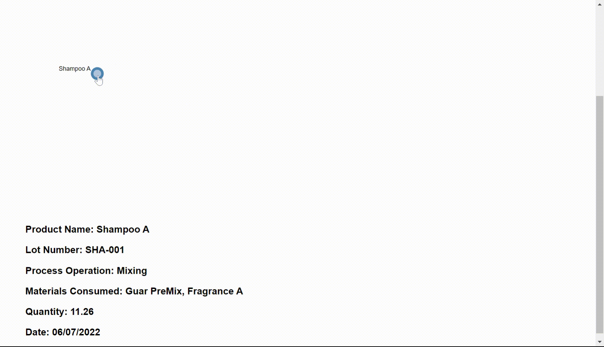

# Product Traceability Tree



The goal of this visualisation is to show the process routes i.e. how the products move through the manufacturing process and how the MES tracks all the product data generated throughout the process.

The visualisation currently tracks the process going backwards, i.e. the initial node on the far left is the final product, and at each level of the tree we are showing the materials and process used to generate the product. However this visualisation can be extended to go forwards in the process: we start with a raw material and the subsequent levels show all the products that used that specific batch of raw material: a "where used" view that is common is ERP systems.

You don't need to be an expert with [d3js](https://d3js.org/) but if you are making any changes to the animations or logic it'll help to atleast go through the [homepage](https://d3js.org/) or you can check out this [introduction video series from Academind](https://www.youtube.com/watch?v=TOJ9yjvlapY).

## Tree Drawing

The code was mostly adapted from [this snippet](https://bl.ocks.org/d3noob/8375092), the key difference in this repo is that it is split into the `./scripts/initialiseTree.js` (declarations) and `./scripts/updateTree.js` (update/enter/exit methods) files.

## Data binding

Data is imported from json files: the `./data/productData.json` holds detailed data on the products and the related process data, and `./data/treeData.json` provides data that is responsible for the child/parent relationships used to generate the tree structure.

## Tree structure

The tree data from the json file is used to create a `d3.hierarchy` data structure [(read more here)](https://observablehq.com/@d3/d3-hierarchy) which is passed to the `d3.tree` to initalise a [tree layout](https://observablehq.com/@d3/tree)

```
// ./scripts/initialiseTree.js
export const treemap = d3.tree().size([height, width]);

...

export const root = d3.hierarchy(treeData, function (d) {
  return d.children;
});
```

```
// ./scripts/updateeTree.js

  const treeData = treemap(root);

  // Compute the new tree layout.
  const nodes = treeData.descendants(),
    links = treeData.descendants().slice(1);

```
